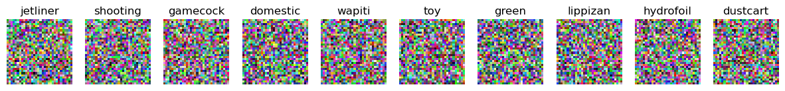
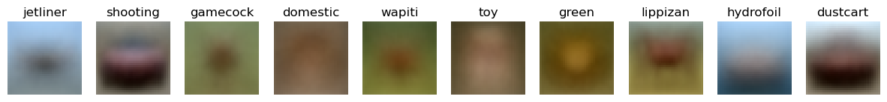
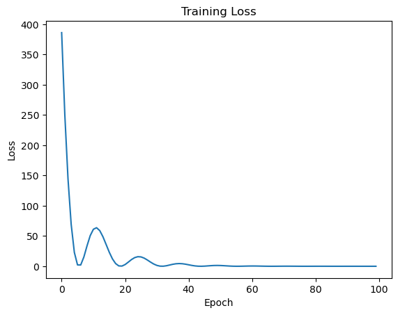

# Models for Image 

Dataset used: CIFAR-10

## 1. Nearest Neighbour Classifier
hyper parameters:
| hyperparameters | desc | findings |
|------|------|------|
| k | number of nearest neighbours to consider | 1 |
| distance | distance metric to use | 'Cosine' |

> Accuracy Achieved : 36.72%

## 2. Linear Model 

findings : 
Weight matrix [shape : (3072, 10) ] plotted as images before training :

Weight matrix plot as images after training :

Loss vs Epochs plot :

loss (100 iterations) : 0.10775

> Accuracy Achieved : 18.93%

