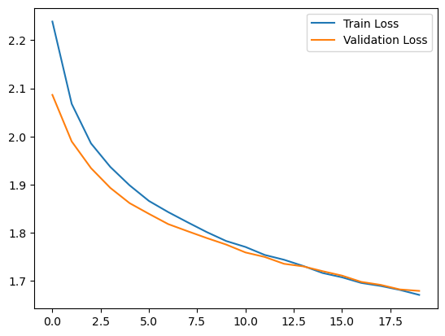
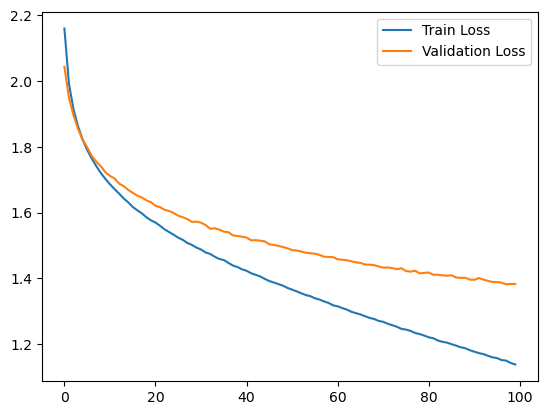

# Models for Image 

Dataset used: CIFAR-10

## Report :

| Model | Accuracy | Epochs | Batch Size | Learning Rate | Optimizer | Time Taken (s) (CPU) |
|------|------| ------| ------| ------| ------|  ------|
| Nearest Neighbour Classifier | 36.72% | |  |  |  |  1 min 30 s |
| Linear Model | 18.93% | 100 | 64 | 1e-6 | SGD |  30 s |
| MLP with 2 hidden layers | 27.10% | 20 | 64 | 1e-6 | Adam | 2 min 42 s |
| MLP with 3 hidden layers | 35.79% | 20 | 64 | 1e-6 | Adam | 2 min 08 s |
| MLP with 3 hidden layers and batch normalization | 43.23% | 10 | 64 | 1e-6 | Adam | 1 min 14 s |
| MLP with 3 hidden layers and batch normalization | 46.54% | 20 | 64 | 1e-6 | Adam | 2 min 16 s |
| MLP with 3 hidden layers and dropout , batch normalization | 39.53% | 20 | 64 | 1e-6 | Adam | 2 min 30 s |
| Ensemble MLP with 3 hidden layers with batch normalization | 52.79% | 100 | 64 | 1e-6 | Adam | 11 min 33 s |

## 1. Nearest Neighbour Classifier
hyper parameters findings:

* k : number of nearest neighbours to consider =  1 
* distance : distance metric to use  = 'Cosine' 


#### **Accuracy Achieved : 36.72%**

## 2. Linear Model 

findings : 
Weight matrix [shape : (3072, 10) ] plotted as images before training :


Weight matrix plot as images after training :


Loss vs Epochs plot :


loss (100 iterations) : 0.10775


#### **Accuracy Achieved : 18.93%**


## 3. Multi Layer Perceptron (MLP)

Batch size = 64 (mini batch gradient descent) with **Adam optimizer**

### 3.1. MLP with 2 hidden layers

hyper parameters: h1 = 128 neurons, learning rate = 1e-6, epochs = 20
```
FCNet(
  (fc1): Linear(in_features=3072, out_features=128, bias=True)
  (relu): ReLU()
  (fc2): Linear(in_features=128, out_features=10, bias=True)
)
```

Loss vs Epochs plot :


#### **Test Accuracy: 27.10%**

### 3.2. MLP with 3 hidden layers

hyper parameters: h1 = 1024 neurons, h2 = 64, learning rate = 1e-6, epochs = 20

```
FCNet3(
  (fc1): Linear(in_features=3072, out_features=1024, bias=True)
  (relu): ReLU()
  (fc2): Linear(in_features=1024, out_features=64, bias=True)
  (relu): ReLU()
  (fc3): Linear(in_features=64, out_features=10, bias=True)
)
```

Loss vs Epochs plot :


#### **Test Accuracy: 35.79%**

### 3.3. MLP with 3 hidden layers and batch normalization

hyper parameters: h1 = 1024 neurons, h2 = 64, learning rate = 1e-6

```
FCNet3_BN(
  (fc1): Linear(in_features=3072, out_features=1024, bias=True)
  (bn1): BatchNorm1d(1024, eps=1e-05, momentum=0.1, affine=True, track_running_stats=True)
  (relu): ReLU()
  (fc2): Linear(in_features=1024, out_features=128, bias=True)
  (bn2): BatchNorm1d(128, eps=1e-05, momentum=0.1, affine=True, track_running_stats=True)
  (relu): ReLU()
  (fc3): Linear(in_features=128, out_features=10, bias=True)
)
```

#### 10 epochs
Loss vs Epochs plot :


#### **Test Accuracy: 43.23%**

#### 20 epochs
Loss vs Epochs plot :


#### **Test Accuracy: 46.54%**

### 3.4. MLP with 3 hidden layers and dropout , batch normalization

hyper parameters: h1 = 1024 neurons, h2 = 64, learning rate = 1e-6, epochs = 20

```
FCNet3_BN_DO(
  (fc1): Linear(in_features=3072, out_features=1024, bias=True)
  (bn1): BatchNorm1d(1024, eps=1e-05, momentum=0.1, affine=True, track_running_stats=True)
  (relu): ReLU()
  (dropout1): Dropout(p=0.5, inplace=False)
  (fc2): Linear(in_features=1024, out_features=128, bias=True)
  (bn2): BatchNorm1d(128, eps=1e-05, momentum=0.1, affine=True, track_running_stats=True)
  (relu): ReLU()
  (dropout2): Dropout(p=0.7, inplace=False)
  (fc3): Linear(in_features=128, out_features=10, bias=True)
)
```

Loss vs Epochs plot :



#### **Test Accuracy: 39.53%**

### 3.5. Ensemble MLP with 3 hidden layers with batch normalization 

hyper parameters: h1 = 1024 neurons, h2 = 64, learning rate = 1e-6, epochs = 100

ensembles at 25, 50, 75 & 100 epochs

Loss vs Epochs plot :



```
FCNet3_BN(
  (fc1): Linear(in_features=3072, out_features=1024, bias=True)
  (bn1): BatchNorm1d(1024, eps=1e-05, momentum=0.1, affine=True, track_running_stats=True)
  (relu): ReLU()
  (fc2): Linear(in_features=1024, out_features=128, bias=True)
  (bn2): BatchNorm1d(128, eps=1e-05, momentum=0.1, affine=True, track_running_stats=True)
  (fc3): Linear(in_features=128, out_features=10, bias=True)
)
```

#### **Test Accuracy: 52.79%**